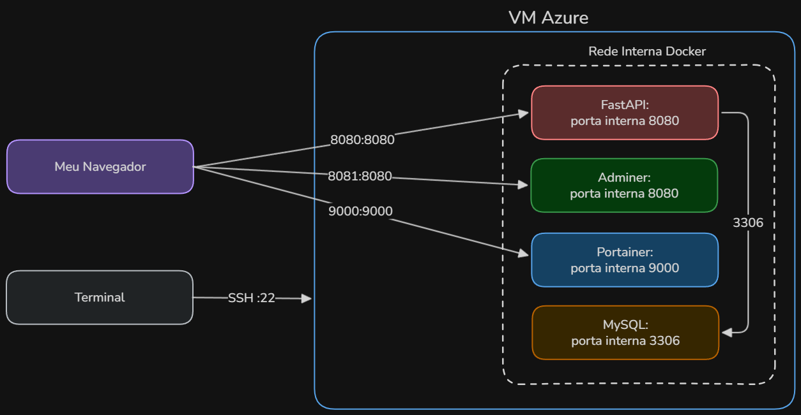

# 🐋 Projeto Docker na Nuvem

Ambiente containerizado com Docker Compose provisionado em VM Linux no Azure via Terraform.

**Repositório:** [github.com/victor-alberto-dev/projeto-docker-nuvem-c2](https://github.com/victor-alberto-dev/projeto-docker-nuvem-c2)

---

## Visão geral

Este projeto provisiona automaticamente uma VM Linux no Azure usando Terraform e sobe um ambiente Docker Compose com quatro serviços:

| Serviço | Imagem | Porta |
|---|---|---|
| API Web (FastAPI) | Imagem customizada (Python 3.11) | 8080 |
| Banco de dados | MySQL 8.0 | Apenas interna (3306) |
| Adminer | adminer | 8081 |
| Portainer | portainer/portainer-ce | 9000 |

---

## Arquitetura



O navegador e o terminal acessam a VM Azure de formas distintas:
- **HTTP** (portas 8080, 8081, 9000) → containers via Docker Compose
- **SSH** (porta 22) → gerenciamento da VM pelo terminal

O MySQL não é exposto externamente. A comunicação com a API acontece pela rede interna do Docker Compose.

---

## Tecnologias

- **Terraform:** Provisionamento da infraestrutura no Azure (VM, VNet, NSG, IP público).
- **Docker + Docker Compose:** Containerização e orquestração dos serviços.
- **FastAPI:** API web com endpoints REST.
- **SQLAlchemy:** ORM para comunicação com o MySQL.
- **MySQL 8.0:** Banco de dados com persistência via volume Docker.
- **Adminer:** Interface gráfica para administração do banco.
- **Portainer:** Interface gráfica para gerenciamento dos containers.
- **Azure:** Nuvem utilizada (VM Standard_B2s, Ubuntu 24.04 LTS).

---

## Estrutura do projeto

```
projeto-docker-nuvem-c2/
├── app/
│   ├── docker-compose.yml
│   ├── Dockerfile
│   ├── main.py
│   └── requirements.txt
├── docs/
│   └── arquitetura-docker.png
├── terraform/
│   ├── main.tf
│   ├── outputs.tf
│   └── variables.tf
├── .gitignore
└── README.md
```

---

## Como executar

### Pré-requisitos

- Terraform instalado.
- Conta no Azure com Service Principal configurado.
- Docker e Docker Compose instalados na VM.
- Sugestão de par de chaves SSH para autenticação gerado localmente:
```bash
  ssh-keygen -t rsa -b 4096
```
> **Atenção:** Você também pode configurar um **usuário** e **senha** caso queira uma autenticação mais simples da VM. Basta configurar no Terraform ou diretamente no portal quando for criar o recurso.

### 1. Configurar credenciais do Terraform

Crie o arquivo `terraform/terraform.tfvars` com as credenciais do Service Principal:

```hcl
client_id       = "seu-client-id"
client_secret   = "seu-client-secret"
tenant_id       = "seu-tenant-id"
subscription_id = "seu-subscription-id"
```

> **Atenção:** Este arquivo está no `.gitignore` e **não deve ser versionado** no repositório.

### 2. Provisionar a infraestrutura

```bash
cd terraform
terraform init
terraform apply
```

O output exibirá o IP público da VM.

### 3. Conectar na VM via SSH

```bash
ssh azureuser@<IP_PUBLICO>
```

> **Via chave SSH (recomendado):** conecta automaticamente usando a chave `id_rsa` gerada localmente.  
> **Via usuário e senha:** será solicitado o usuário e a senha configurada durante a criação da VM.

### 4. Subir o ambiente Docker

```bash
cd ~/app
docker compose up -d
```

### 5. Acessar os serviços

| Serviço | URL |
|---|---|
| FastAPI | http://\<IP\>:8080 |
| Documentação (Swagger) | http://\<IP\>:8080/docs |
| Adminer | http://\<IP\>:8081 |
| Portainer | http://\<IP\>:9000 |

---

## Endpoints da API

| Método | Rota | Descrição |
|---|---|---|
| GET | `/` | Verifica se a API está no ar |
| GET | `/items/` | Lista todos os itens |
| POST | `/items/?nome=valor` | Cria um novo item |
| PUT | `/items/{id}?nome=valor` | Atualiza o nome de um item |
| DELETE | `/items/{id}` | Deleta um item |

> **Nota:** O navegador não aceita requisições POST, PUT e DELETE diretamente pela URL. Use a documentação interativa em `http://<IP>:8080/docs` para testar esses endpoints.

---

## Persistência de dados

Os dados do MySQL são armazenados em um volume Docker (`db_data`) mapeado para o disco da VM. Os dados **não são perdidos** ao reiniciar ou recriar os containers.

Para remover os dados junto com os containers:

```bash
docker compose down -v
```

---

## Decisões técnicas

- **`azureuser`** é o usuário padrão do Azure para VMs Linux. Mantido por ser a convenção da plataforma.
- Um **IP público estático** foi configurado no Terraform para garantir que o IP não mude ao reiniciar a VM.

---

## Observações de segurança

- O banco de dados MySQL **não é exposto externamente**. Ele é acessível apenas pelos containers na rede interna Docker.
- A autenticação na VM é feita via **par de chaves SSH** (sem senha).
- As credenciais do Terraform ficam no `terraform.tfvars` que **não é versionado** no repositório.